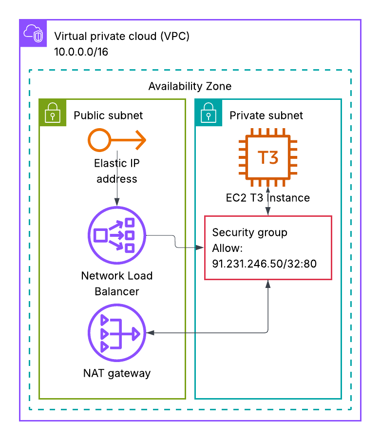

# Web Server Infrastructure with NLB

## Architecture



## Components

| Component | Details | Location |
|-----------|---------|----------|
| **NLB** | Network Load Balancer on port 80 with fixed Elastic IP (VIP) | Public Subnet |
| **EC2** | Apache web server (Amazon Linux 2) | Private Subnet |
| **Security** | Only 91.231.246.50 can access the web server | EC2 Security Group |
| **NAT Gateway** | Enables EC2 outbound internet access | Public Subnet |
| **IGW** | Internet Gateway for internet connectivity | VPC |

## Deploy

```bash
terraform init
terraform plan
terraform apply
```

## Access

From 91.231.246.50:
```bash
# Using fixed Elastic IP (recommended)
curl http://$(terraform output -raw nlb_public_ip)

# Or using DNS
curl http://$(terraform output -raw nlb_dns)
```

Get the NLB endpoints:
```bash
terraform output nlb_public_ip  # Fixed Elastic IP (VIP)
terraform output nlb_dns        # DNS name
```

## Cleanup

```bash
terraform destroy
```
